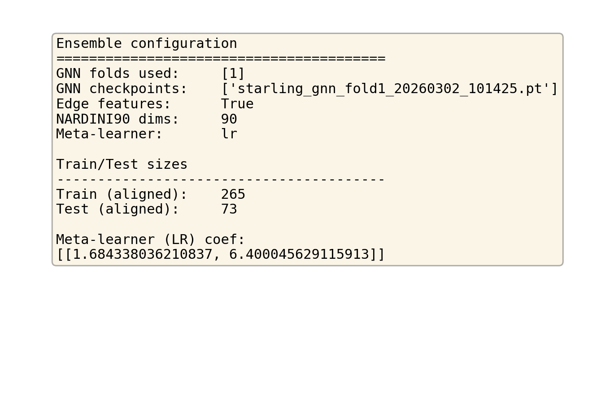
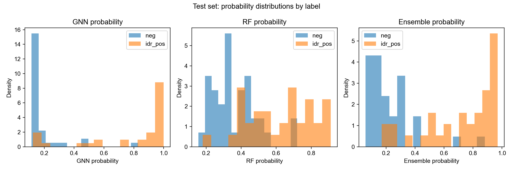
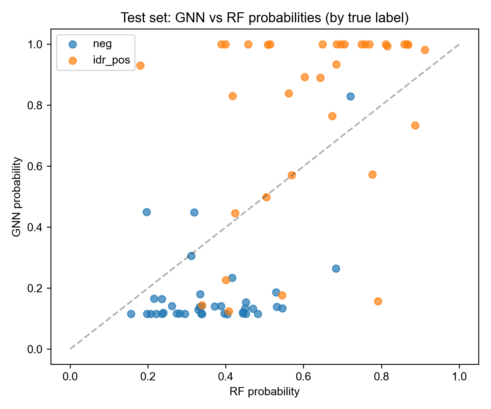
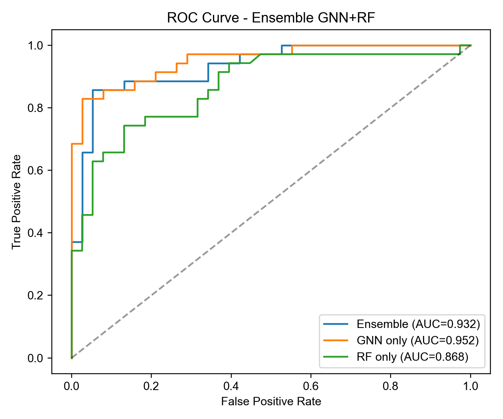
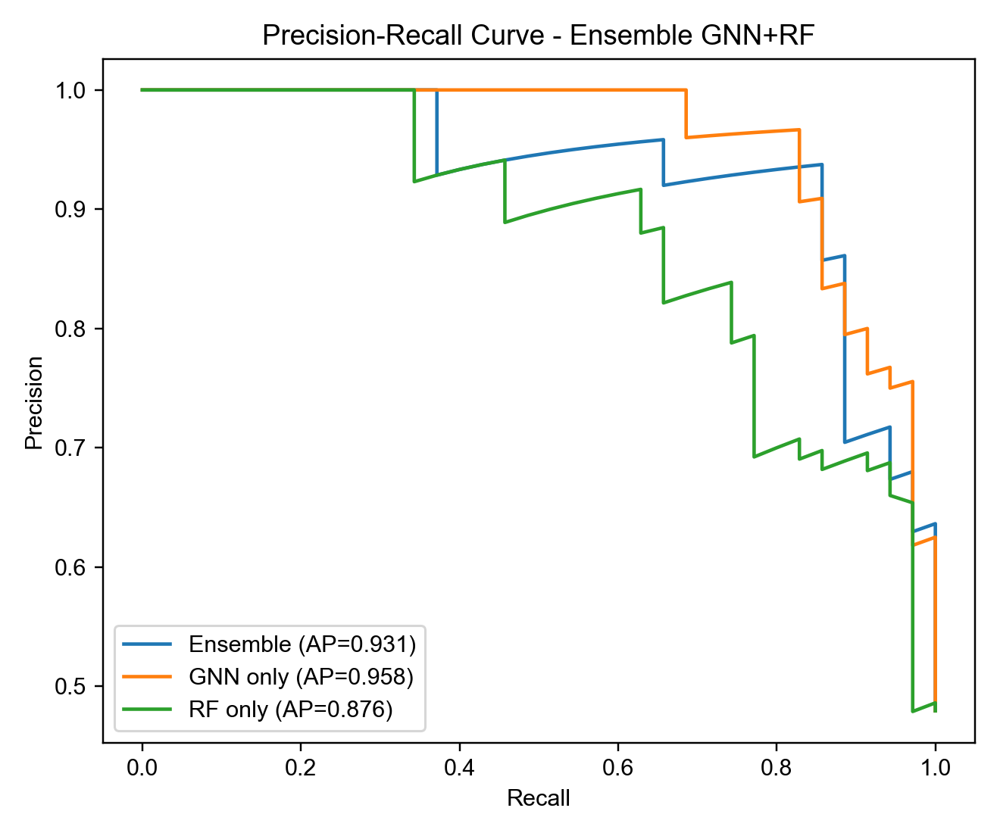
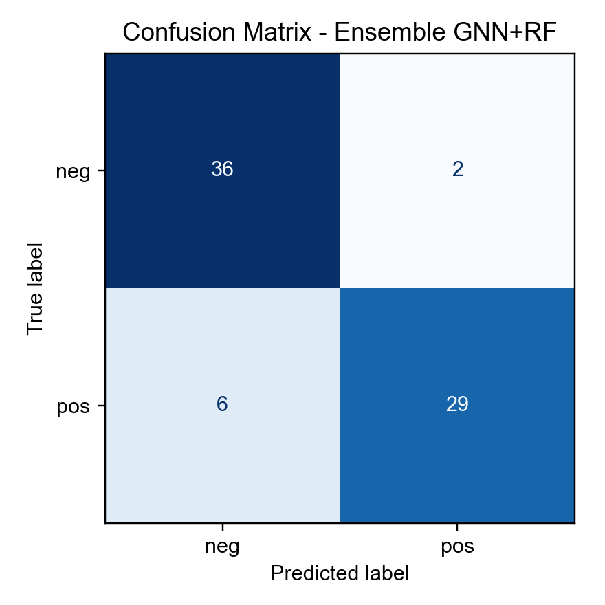
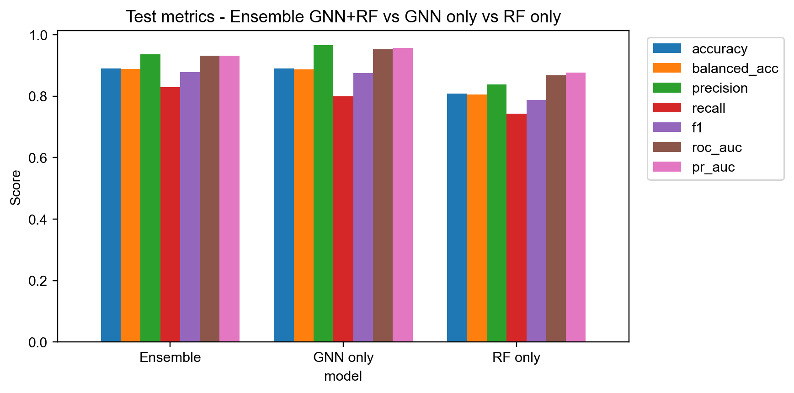

# GNN+RF 融合模型：参数、数据与效果可视化报告

**模型目录（图表所在）**: `ensemble_gnn_rf/`

## 1. 参数与配置

| 项 | 值 |
|---|-----|
| GNN 折数/checkpoint | [1] / ['starling_gnn_fold1_20260302_101425.pt'] |
| 边特征 (edge_dist) | True |
| NARDINI90 特征维度 | 90 |
| 元学习器类型 | lr |
| 训练样本数 (对齐) | 265 |
| 测试样本数 (对齐) | 73 |

## 2. 测试集效果

### 融合模型 (Ensemble)

| 指标 | 值 |
|------|-----|
| accuracy | 0.8904 |
| balanced_accuracy | 0.8880 |
| precision | 0.9355 |
| recall | 0.8286 |
| f1 | 0.8788 |
| roc_auc | 0.9316 |
| pr_auc | 0.9313 |

## 3. 可视化图表

### 3.1 参数与配置

### 3.2 数据分布（测试集预测概率按真实标签）

### 3.3 GNN vs RF 概率散点

### 3.4 ROC 曲线

### 3.5 Precision-Recall 曲线

### 3.6 混淆矩阵

### 3.7 指标对比

